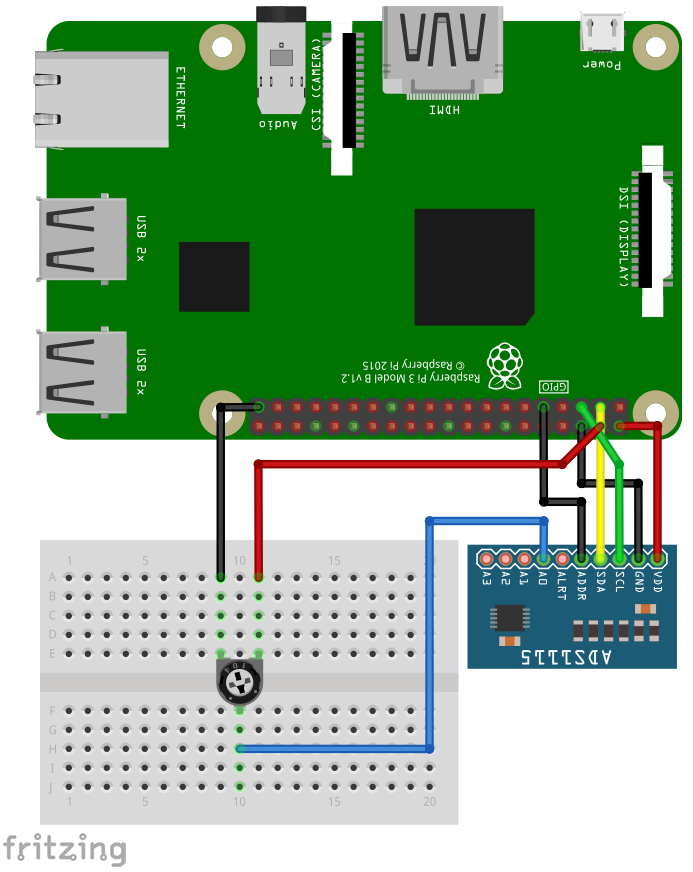

[back to main page](./index.html)

# ADS1015 and ADS1115 - Analog Voltage Sensor - Examples

## Wiring

For running this example, you need an ADS1015 or ADS1115 sensor. SmallBASICPiGPIO is using the I2C-protocol for communication. The Raspberry Pi supports this protocol in hardware, but by default the protocol is disabled. Therefore you have to setup I2C as described [here](./setupi2c.html).
In the next step please wire the sensor as shown in the following image. The example is using an ADS1115 but the ADS1015 will work, too. Use a 10K potentiometer.



The I2C bus is using pin 2 (SDA1) and 3 (SCL1). The sensor can be driven with a voltage from 2.2 to 5.5V. The input pins can be connected to -0.3V to VDD + 0.3V. If you drive the sensor with 5V from the Pi, the maximum allowed voltage at the input pins is 5.3V. If you drive the sensor with 3.3V, the maximum allowed voltage at the input pins is 3.6V.


## Software

```freebasic
import SmallBasicPIGPIO as gpio

const A0  = 4   ' Input A0
const A1  = 5   ' Input A1
const A2  = 6   ' Input A2
const A3  = 7   ' Input A3
const A01 = 0   ' Differential Input A0 - A1
const A03 = 1   ' Differential Input A0 - A3
const A13 = 2   ' Differential Input A1 - A3
const A23 = 3   ' Differential Input A2 - A3


gpio.ADS1X15_Open(0x48)             ' Open device on address 0x48

gpio.ADS1X15_SetChannel(A0)         ' Set input channel A0
gpio.ADS1X15_SetVoltageRange(6.144) ' Set Voltage range from 0 to 6.144V
gpio.ADS1X15_SetSampleRate(128)     ' 128 Samples per second


for ii = 1 to 10
    delay(500)
    print gpio.ADS1X15_ReadVoltage() ' Returns voltage as float
next

gpio.ADS1X15_Close()                ' CLose connection
```

[back to main page](./index.html)
