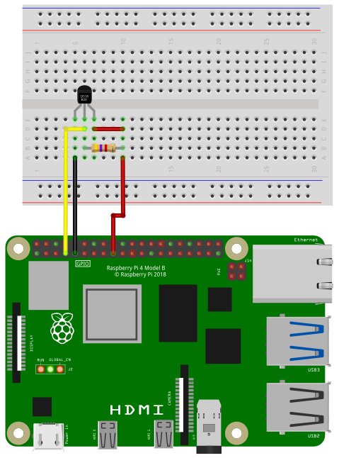

[back to main page](./index.html)

# DS18B20 Temperature Sensor Example

## Wiring

For running this example, you need a DS18B20 temperature sensor and a 4.7kOhms resistor.
If you have the problem, that you get a lot of incorrect readings (error code -2000 or -3000) then
it will help, if you take a 3.3kOhms resistor.



## Software

```freebasic
import SmallBasicPIGPIO as gpio

const PIN_GPIO4 = 4

'Read temperature from sensor on GPIO4
Temp = gpio.DS18B20_GetTemp(PIN_GPIO4)

'Check for errors
if(Temp = -1000) then
	print("Could not find DS18B20 sensor.")
elseif(Temp = -2000) then
	print("Data from sensor was not read correctly.")
elseif(Temp = -3000) then
	print("Could not read sensor data.")
else
	print(Temp)
endif
```

```freebasic
import SmallBasicPIGPIO as gpio

const PIN_GPIO22 = 22


while 1
    repeat
        'Read temperature from sensor on GPIO22
        Temp = gpio.DS18B20_GetTemp(PIN_GPIO22)
    until(Temp > -1000)

    print Temp
    delay(2000)
wend
```


[back to main page](./index.html)
