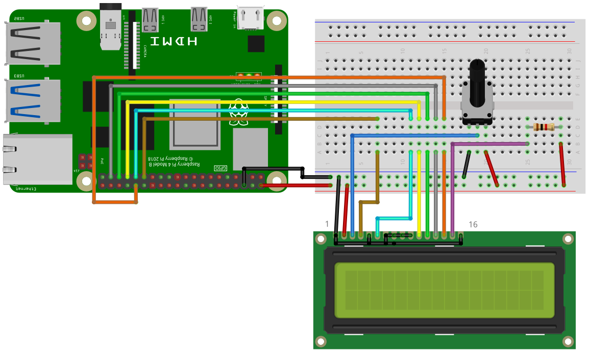

[back to main page](./index.html)

# HD44780 Text Display Example

## Wiring

For running this example, you need a HD44780 compatible text display. Quite common are displays with 1, 2 or 4 lines, with
16 or 20 characters in each line. To adjust the contrast of the display a potentiometer with 10kOhms will be used.
If you have a display with a background LED illumination, then a LED resistor might be neccessary. If you don't aim for maximum 
brightness of the LED, then take a 220 Ohms or even a 1kOhm resistor. The display will be used in 4bit mode, 
therefore the data pins DB0 to DB3 are not used.



Connect the pins of the display to the following pins of the Raspberry Pi

Pin 1 (VSS) -> GND  
Pin 2 (VDD) -> 5V  
Pin 4 (RS)  -> GPIO5  
Pin 5 (R/W) -> GND  
Pin 6 (E) -> GPIO6  
Pin 7 (DB0) -> GND  
Pin 8 (DB1) -> GND  
Pin 9 (DB2) -> GND  
Pin 10 (DB3) -> GND  
Pin 11 (DB4) -> GPIO13  
Pin 12 (DB5) -> GPIO19  
Pin 13 (DB6) -> GPIO26  
Pin 14 (DB7) -> GPIO12  

Pin 3 (V0) -> Connect to the potentiometer  
  
If you have a background LED:  

Pin 15 (LED+) -> Connect to the LED resistor  
Pin 16 (LED-) -> GND  


## Software

```python
import SmallBasicPIGPIO as gpio

' The display is connected to the following pins
const PIN_RS = 5
const PIN_E = 6
const PIN_D4 = 13
const PIN_D5 = 19
const PIN_D6 = 26
const PIN_D7 = 12

'Init the display
gpio.LCD1Init(PIN_RS, PIN_E, PIN_D4, PIN_D5, PIN_D6, PIN_D7)

'Clear LCD and move cursor to position (1,1)
gpio.LCD1Cls()
gpio.LCD1Print("Test1")

'Move cursor to position (5,2)
gpio.LCD1Locate(5,2)
gpio.LCD1Print("Test2")

'Turn LCD off and on
delay(1000)
gpio.LCD1Off()
delay(1000)
gpio.LCD1On()
```


[back to main page](./index.html)
