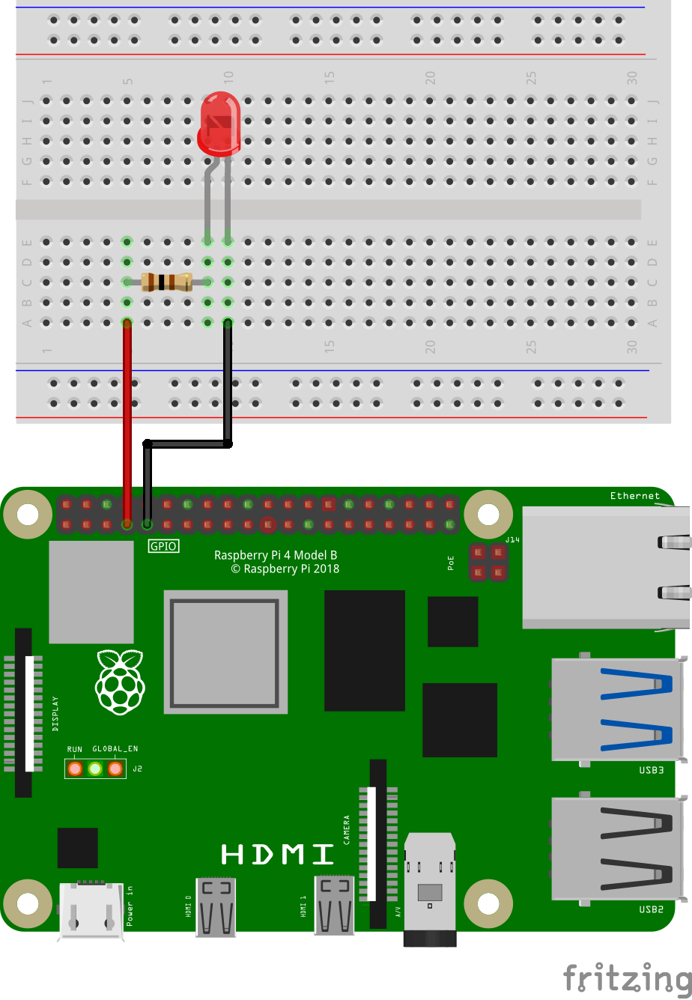

[back to main page](./index.html)

# LED Examples

## Wiring

In the following image you can see how to wire a LED.



Depending on the type of the LED you need a certain resistor. When using the LED without a resistor,
you will destroy the LED and maybe even parts of your Raspberry Pi.

When you buy a LED, look for two important values in the specification: Forward Voltage and Forward Current.
The third important value is the Supply Voltage. In case of a Raspberry Pi it is 3.3V. Online you
can find many LED resistor calculators. But if you want to see your LED blinking without studying to much
and you don't expect maximum brightness, then go for 220 Ohms or even 1000 Ohms.

Connect the resistor to pin 4 and the LED to ground ([pin numbering](./gpio_numbering.html))

## Software

### Simple blinking

```freebasic
import SmallBasicPIGPIO as gpio

' LED is connected to pin GPIO4
const PIN_GPIO4 = 4

' Set pin as an output
gpio.GPIO_SetOutput(PIN_GPIO4)

for ii = 1 to 5
	print(ii)
	'Set GPIO pin to high -> 3.3V
	gpio.GPIO_Write(PIN_GPIO4, 1)
	delay(500)
	'Set GPIO pin to low -> ground
	gpio.GPIO_Write(PIN_GPIO4, 0)
	delay(500)
next
```

### Change brightness with PWM

```freebasic
import SmallBasicPIGPIO as gpio

' LED is connected to pin GPIO4
const PIN_GPIO4 = 4

' Set pin as an output
gpio.GPIO_SetOutput(PIN_GPIO4)

' Duty cycle is a value between 0 and 255.
' 0 -> LED is off
' 128 -> LED half brightness
' 255 -> LED max. brightness

for DutyCycle = 0 to 255 step 20

	print(DutyCycle)
	
	gpio.GPIO_Pwm(PIN_GPIO4, DutyCycle)
	
	delay(200)

next
```

[back to main page](./index.html)
