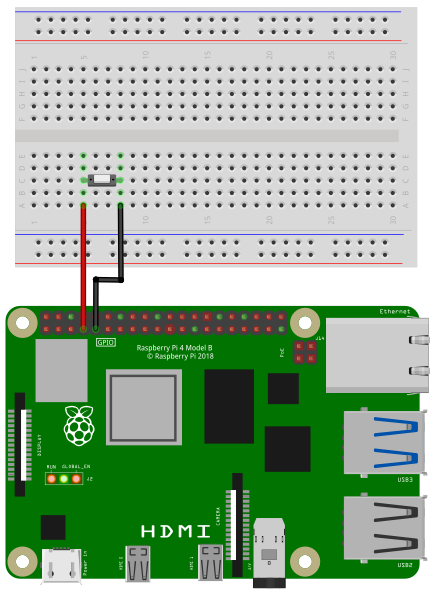

[back to main page](./index.html)

# Push Button Example

## Wiring

In the following image you see the wiring of a push button. 
When you press the button, the circuit will be closed, otherwise
the circuit is open. The button is connected to pin 4 and
ground ([see pin numbering](./gpio_numbering.html)). An internal
pullup resistor will be enabled automaticly.



## Software

```freebasic
import SmallBasicPIGPIO as gpio

const PIN_GPIO4 = 4

' Set GPIO pin 4 to INPUT. When a pin is set to input,
' the internal pullup resistor will be enabled automaticly
gpio.GPIOSetInput(PIN_GPIO4)

repeat 
	key = inkey()
	
	' Read the state of the pin. It will return 0 or 1.
	status = gpio.GPIORead(PIN_GPIO4)
	locate 1,1: print(status)
	
	showpage()
	delay(50)	
	
until key <> ""
```
[back to main page](./index.html)
