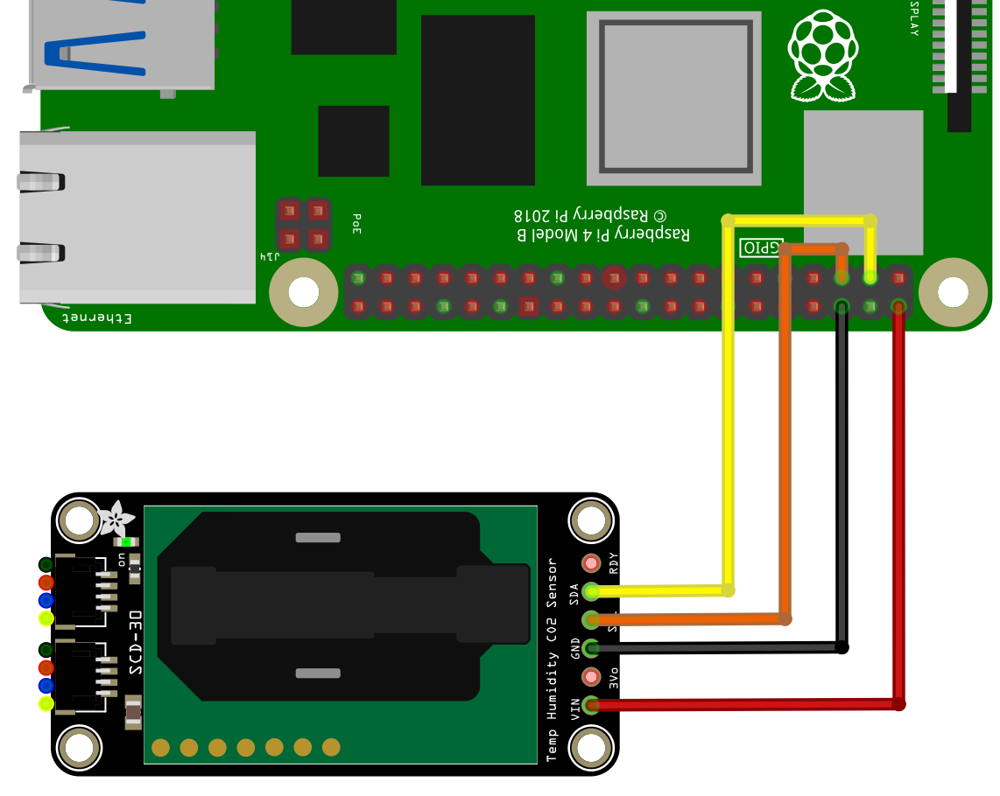

[back to main page](./index.html)

# SCD30 - CO2, Temperature and Humidity Sensor - Example

## Wiring

For this example the Adafruit SCD30 sensor will be used. The SCD30 uses the I2C protocol for communication.
The Raspberry Pi support this protocol in hardware, but by default the protocol is disabled. Therefore you
have to setup I2C as described [here](./setupi2c.html). In the next step please wire the sensor as shown in
the following image.



The I2C bus is using pin 2 (SDA1) and 3 (SCL1). If you use the Adafruit sensor, then you can connect to VCC
either 3.3V or 5V. If you have a bare SCD30-Sensor please power it only with 3.3V.

## Software

```freebasic
import SmallBasicPIGPIO as gpio

gpio.SCD30Open()
gpio.SCD30SetInterval(2) 'measurement interval 2s

for ii = 1 to 10

    'check if new data is available
    while(gpio.SCD30DataAvailable() != 1)
        delay(100)
    wend

    'Read the data. A array with three elements will be returnd.
    'Element 0: CO2 in ppm; Element 1: Temperature in °C; Element 2: Humidity in %RH

    Measurement = gpio.SCD30ReadData()

    print "CO2: "; round(Measurement(0)); "ppm | T: "; round(Measurement(1),1); "°C | H: "; round(Measurement(2));"%RH"

next

gpio.SCD30Close()
```


[back to main page](./index.html)
