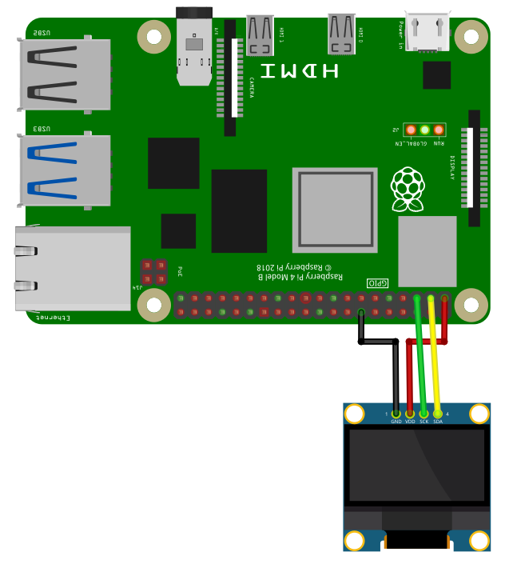

[back to main page](./index.html)

# SSD1306 OLED Display Example

## Wiring

For running this example, you need a SSD1306 compatible OLED display. OLEDs with 128x64 or 128x32 pixels are supported. SmallBASICPiGPIO is using the I2C-protocol for communication. The Raspberry Pi support this protocol in hardware, but by default the protocol is disabled. Therefore you have to setup I2C as described [here](./setupi2c.html). In the next step please wire the sensor as shown in the following image.



The I2C bus is using pin 2 (SDA1) and 3 (SCL1).

## Software

```freebasic
import SmallBasicPIGPIO as gpio

gpio.OLED1_Open()

gpio.OLED1_SetBrightness(128)

gpio.OLED1_Cls()

gpio.OLED1_Pset(10,0)
gpio.OLED1_Line(0,0,127,63)
gpio.OLED1_RoundRect(54,26,74,38,5)
gpio.OLED1_Circle(118,10,5,1,1) 'Filled with white
gpio.OLED1_Triangle(118,30, 113,45, 123,45, 1, 1) 'Filled with white

gpio.OLED1_At(0,56)
gpio.OLED1_SetTextSize(16)
gpio.OLED1_Print("SmallBASIC")


'Let's move a image of a smiley with transparency over the screen

'Create an image array with 16x16 Pixels
dim SmilyGuyArray(15,15)

for yy = 0 to 15
  for xx = 0 to 15
    read d
    SmilyGuyArray(xx,yy) = d
  next
next

dim Background

for xx = 1 to 127

    Background = gpio.OLED1_CopyFromDisplay(xx, 25, 16, 16) 'Save the part of the OLED display,
                                                            'where we want to draw the smiley.
    gpio.OLED1_CopyToDisplay(SmilyGuyArray, xx, 25, 3)      'Copy the array to the display
                                                            'Mode = 3 -> Pixel value: 0=Black;
                                                            '255=White; Every other number is
                                                            'rendered transparent
    gpio.OLED1_Display()                                    'Display the buffer
    gpio.OLED1_CopyToDisplay(Background, xx, 25)            'Copy the saved background back to
                                                            'the display. This will remove the
                                                            'smiley. In the next iteration of
                                                            'the loop, you have the original
                                                            'background image.
next

delay(2000)
gpio.OLED1_Close()

print("Done")


'Smiley Guy
'0=Black; 255=White; Every other number is transparent
DATA   1,  1,  1,255,255,255,255,255,255,255,255,255,255,  1,  1,  1
DATA   1,  1,255,255,255,255,255,255,255,255,255,255,255,255,  1,  1
DATA   1,  1,255,255,255,255,255,255,255,255,255,255,255,255,  1,  1
DATA   1,  1,255,255,  0,  0,  0,  0,  0,  0,  0,  0,255,255,  1,  1
DATA   1,  1,255,  0,255,255,255,  0,  0,255,255,255,  0,255,  1,  1
DATA   1,255,  0,  0,  0,  0,  0,  0,  0,  0,  0,  0,  0  ,0  ,255,1
DATA 255,255,  0,  0,255,255,  0,  0,  0,  0,255,255,  0,  0,255,255
DATA 255,255,  0,  0,255,255,  0,255,  0,  0,255,255,  0,  0,255,255
DATA 255,255,  0,  0,  0,  0,  0,255,255,  0,  0,  0,  0,  0,255,255
DATA   1,255,  0,  0,  0,  0,  0,  0,  0,  0,  0,  0,  0,  0,255,  1
DATA   1,255,  0,  0,255,  0,  0,  0,  0,  0,  0,255,  0,  0,255,  1
DATA   1,  1,255,  0,  0,255,  0,  0,  0,  0,255,  0,  0,255,  1,  1
DATA   1,  1,255,  0,  0,  0,255,255,255,255,  0,  0,  0,255,  1,  1
DATA   1,  1,  1,255,  0,  0,  0,  0,  0,  0,  0,  0,255,  1,  1,  1
DATA   1,  1,  1,  1,255,255,255,255,255,255,255,255,  1,  1,  1,  1
DATA   1,  1,  1,  1,  1,255,255,255,255,255,255,  1,  1,  1,  1,  1
```


In the next example we will load an png image, convert it to an array and display it with full transparency. Please downlad the following image and place it in the same folder as the programm.


The white and the black parts of the image will be drawn on the display. The pinkish parts will be transparent. (Every pixel which is neither white nor black will be transparent)

```freebasic
import SmallBasicPIGPIO as gpio

'Load an image
I = image("oled1_example.png")

'Convert image to array with gray values
A = PngToGrayArray(I)

'Display array on the OLED
gpio.OLED1_Open()

gpio.OLED1_Cls()
gpio.OLED1_CopyToDisplay(A,0,0,3)  'using mode 3 for best transparency
gpio.OLED1_Display()

delay(2000)
gpio.OLED1_Close()


'Function for converting an image to an array with gray values
func PngToGrayArray(byref Img)

    local A, A_Rotated, r, g, b, xx, yy
    dim A

    Img.save(A)

    dim A_Rotated(Img.width, Img.height)

    for xx = 0 to Img.width - 1
        for yy = 0 to Img.height - 1

            'alpha = (A[xx,yy] & 0xFF000000) rshift 24
            r     = ((A[xx,yy] & 0x00FF0000) rshift 16)
            g     = ((A[xx,yy] & 0x0000FF00) rshift 8)
            b     = ((A[xx,yy] & 0x000000FF))

            ' this is a quite bad conversion to gray values but will do for the oled.
            A_Rotated[yy,xx] = ceil((r+g+b) / 3)
        next
    next

    PngToGrayArray = A_Rotated

end func
```

[back to main page](./index.html)
