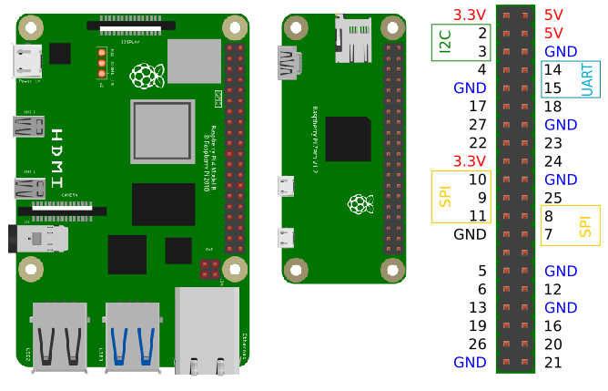

[back to main page](./index.html)

## Numbering of GPIO Pins

The GPIO pins of the Raspberry Pi 3, 4, Zero (W), and Zero 2 are numbered in the following way in SmallBasicPIGPIO (using Broadcom numbers):

[back to main page](./index.html)
