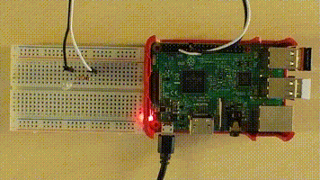

If you want to let a LED blink or measure the temperature in your room, you can use [SmallBASIC](https://smallbasic.github.io) on a Raspberry PI now. As an example just connect a LED and a resistor to a GPIO-Pin of your Raspberry Pi, write a short SmallBASIC programm and enjoy the blinking LED.

```basic
import SmallBasicPIGPIO as gpio

const PIN_GPIO4 = 4

gpio.GPIO_SetOutput(PIN_GPIO4)

for ii = 1 to 5
	gpio.GPIO_Write(PIN_GPIO4, 1)
	delay(500)
	gpio.GPIO_Write(PIN_GPIO4, 0)
	delay(500)
next
```


***
## News

### Advanced button example
Mai 17, 2022 - For details see [Push Button](./example_pushbutton.html)

### BH1750 Ambient Light Sensor added
April 11, 2022 - For details see: [BH1750 Ambient Light Sensor](./bh1750.html)

### SSD1306 OLED Graphics Display added
February 20, 2022 - For details see: [SSD1306 OLED Display](./ssd1306.html)

***

## Setup and Pin numbering

- [Setup of SmallBasicPIGPIO](./setup.html)
- [Naming and Numbering of the GPIO-Pins](./gpio_numbering.html)
- [Setup I2C](./setupi2c.html)

## Commands by Topic

- [Basic GPIO commands](./gpio.html): Input and output to the GPIO pins.
- [DS18B20 Temperature Sensor](./ds18b20.html): Measure the environment temperature.
- [HD44780 compatible Text LCD Display](./hd44780.html): Print text on a cheap but highly readable text-only display.
- [SSD1306 compatible OLED Display](./ssd1306.html): Draw graphics on this small and very cheap black and white OLED display.
- [BH1750 Ambient Light Sensor](./bh1750.html): Measure the ambient light.
- [SCD30 CO2, Temperature and Humidity Sensor](./scd30.html): Powerfull and extrem precise sensor for measuring CO2, temperature and humidity.

## Examples

- [LED](./example_led.html)
- [Push Button](./example_pushbutton.html)
- [DS18B20 Temperature Sensor](./example_ds18b20.html)
- [HD44780 Text LCD Display](./example_hd44780.html)
- [SSD1306 OLED Display](./example_ssd1306.html)
- [BH1750 Ambient Light Sensor](./example_bh1750.html)
- [SCD30 CO2, Temperature and Humidity Sensor](./example_scd30.html)

## Projects

- [SmallBASIC Pi Console](./sbconsole.html)
<video width='200' controls loop autoplay muted>
	<source src='./images/SBConsole.mp4' type='video/mp4'>
</video>

## Links

- [SmallBasicPIGPIO at Github](https://github.com/Joe7M/SmallBasicPIGPIO)
- [Feedback for SmallBasicPIGPIO](https://github.com/Joe7M/SmallBasicPIGPIO/discussions)
- [SmallBASIC website](https://smallbasic.github.io/)
- [SmallBASIC forum](https://www.syntaxbomb.com/smallbasic/)
