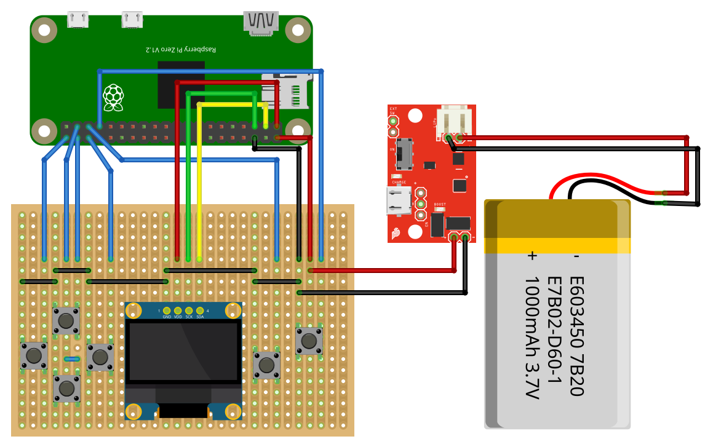
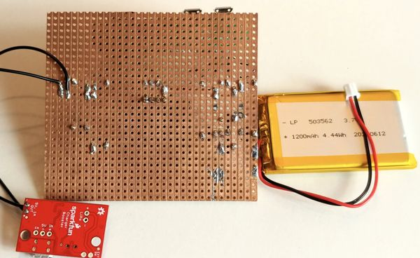
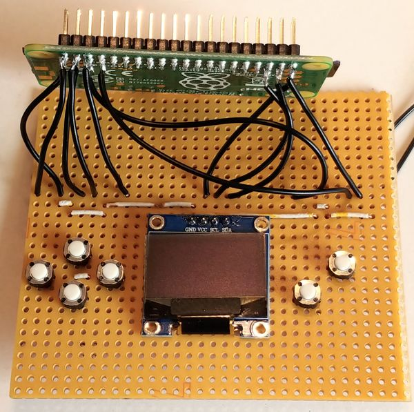
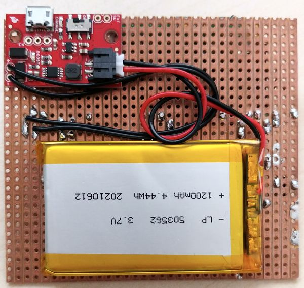
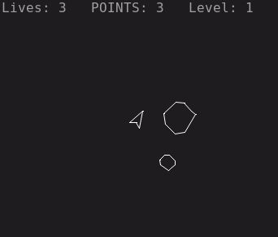

[back to main page](./index.html)

# SmallBASIC Pi Console

SmallBASIC Pi Console is a litte handheld using a Raspberry Pi Zero W. You can connect a screen via
HDMI or just use the little OLED display for your own programs. It has 6 push buttons which can be used freely.
The Raspberry Pi is powered by a Lithium polymere battery. When connecting a USB power supply, the device will be
powered by USB and the battery will be recharged. All GPIO pins are accessible and can be used to connect
sensors, LEDs and other cool thinks.

Click on the video to see the start screen of a SmallBASIC version of Asteroids:

<video width='400' controls loop autoplay muted>
	<source src='./images/SBConsole.mp4' type='video/mp4'>
</video>

My version of the handheld is just a simple and little bit ugly prototype with some cheap components I had at home. If you assemble a
nicer looking device, I would be happy to see them and get some inspirations.

## Materials

- 1 Raspberry Pi Zero W (if you find, the Raspberry Pi Zero 2 would be a better choice)
- 1 SD Card (i.e. 16 GB)
- 6 push buttons
- 1 SSD1306 OLED display
- 1 Lithium Polymer battery charger and booster
  - chose a board with a built-in load-sharing circuit, usually the cheap boards on Ebay don't support this. 
    - i.e. SparkFun LiPo Charger/Booster - 5V/1A
    - i.e. Adafruit PowerBoost 1000 Charger - Rechargeable 5V Lipo USB Boost @ 1A - 1000C
- 1 Lithium Polymer battery
  - i.e. Adafruit Lithium Ion Polymer Battery - 3.7v 1200mAh
  - i.e. Sparkfun Lithium Ion Battery - 1250mAh
- 1 Perfboard plate with 2.54mm (0.1 inch) spacing
- Wires

(I don't get money from the companies I mentioned here. Take the devices as ideas. Feel free to buy whatever you want.)

## Wiring



[Download Fritzing file](./assets/sbconsole_wiring.fzz)

## Soldering

I used a perfboard with rows of copper lanes. Be carefull when soldering, that you don't accidentally connect two rows. Use a sharp knife to cut a copper lane if necessary.
In the following image, you can see the backside of the perfboard. You might notice, that I'm not an expert in soldering.



One important goal was, that all GPIO pins can be easily accessed. To achieve this, I soldered wires to the pins on the backside of the Raspberry Pi Zero. The other side of the wires are soldered to the perfboard as can be seen in the next image.



After finish soldering I used a hot glue gun to glue the Raspberry Pi to the front side of the perfboard. On the backside I glued the battery and the charger module. Be careful that you leave a little gap between the charger board and the perfboard to prevent a short circuit.



## Setup

coming soon

## Software

### Asteroids

[Download](./assets/asteroid.bas) the source code and save it as asteroid.bas. Run it with the SmallBASIC console-version:
```
sudo sbasic -m /home/pi/SmallBasicPIGPIO/bin asteroids.bas
```



[back to main page](./index.html)
