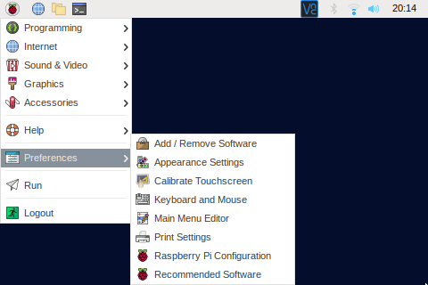
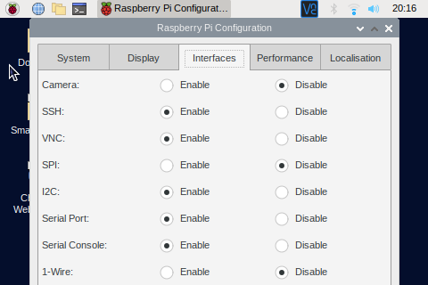

[back to main page](./index.html)

# Setup I2C on the Raspberry Pi

- Desktop:
  - Open the menu.
  - Select "Preferences"
  - Start "Raspberry Pi Configuration"
  - Open the tab "Interfaces"
  - Enable "I2C"
  - Save settings
  - Restart Raspberry Pi
   

- Comand Line:
  - Type "sudo raspi-config"
  - Select "Interface Options"
  - Select "P5 I2C"
  - Select "Yes"  

[back to main page](./index.html)
